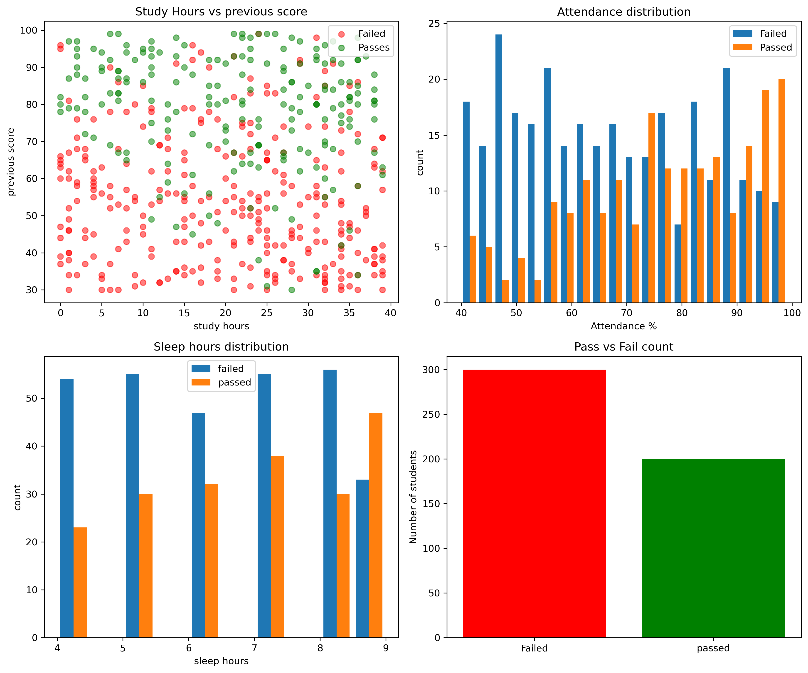
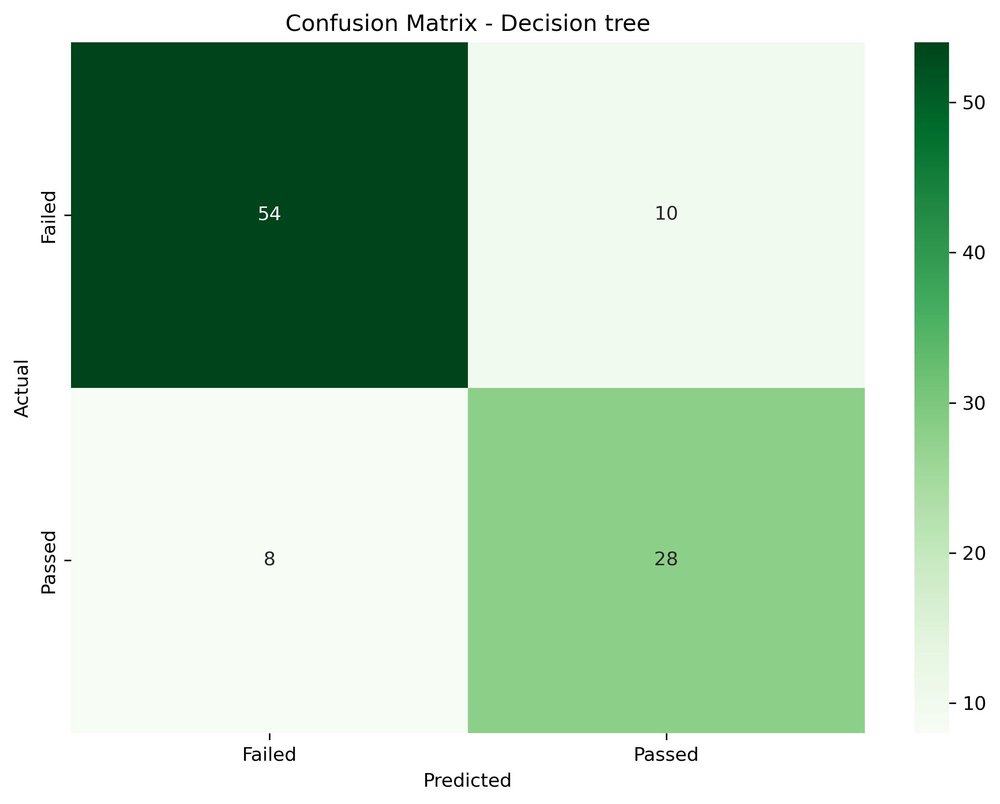

# Student Pass/Fail Predictor

Binary classifier comparing Logistic Regression and Decision Tree algorithms to predict student exam outcomes based on study habits and performance metrics. Decision Tree achieved 82% accuracy.

## Performance

| Model | Accuracy | Status |
|-------|----------|--------|
| Decision Tree | 82.00% | Winner |
| Logistic Regression | 78.00% | - |

## Dataset

Synthetic student dataset:
- Total students: 500
- Passed: 200 (40%)
- Failed: 300 (60%)
- Train/test split: 80/20

### Features
- **study_hrs**: Weekly study hours (0-50)
- **previous_score**: Previous exam score (0-100)
- **attendance**: Attendance percentage (0-100)
- **sleep_hrs**: Daily sleep hours (4-9)

## Results

### Decision Tree (Best Model)
```
              precision    recall  f1-score   support

      Failed       0.85      0.86      0.85        64
      Passed       0.75      0.72      0.74        36

    accuracy                           0.82       100
```

### Logistic Regression
```
              precision    recall  f1-score   support

      Failed       0.85      0.80      0.82        64
      Passed       0.68      0.75      0.71        36

    accuracy                           0.78       100
```

## Technologies

- Python
- scikit-learn
- pandas
- NumPy
- matplotlib
- seaborn

## Visualizations





## Installation

```bash
git clone https://github.com/varadshajith/student-pass-fail-predictor.git
cd student-pass-fail-predictor
pip install -r requirements.txt
```

## Usage

```python
from sklearn.tree import DecisionTreeClassifier

# Train model
model = DecisionTreeClassifier(random_state=42)
model.fit(X_train, y_train)

# Predict
prediction = model.predict([[study_hrs, prev_score, attendance, sleep_hrs]])
# 0 = Failed, 1 = Passed
```

## Project Structure

```
student-pass-fail-predictor/
├── pass_fail_predictor.ipynb
├── README.md
└── requirements.txt
```

## Key Insights

Decision Tree outperformed Logistic Regression due to its ability to capture non-linear relationships between study patterns and exam outcomes. The model identifies complex interactions between features that linear models cannot represent.

## License

MIT License

## Contact

Varad Shajith
- GitHub: [@varadshajith](https://github.com/varadshajith)
- Email: varadshajith@gmail.com
